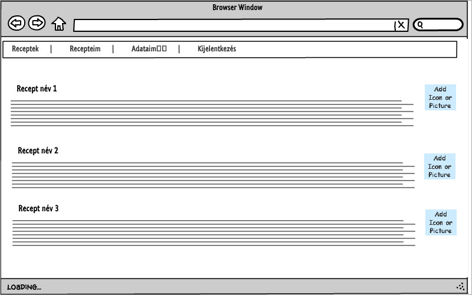

# Követelményanalízis

## Funkcionális követelmények

- Vendégként recepteket megtekinteni.
- Felhasználóként(Receptszerkesztő) szeretnék recepteket megosztani másokkal: Recept hozzáadás
- Felhasználóként szeretnék módosítani a receptjeimen: Recept módosítás
- Felhasználóként szeretnék recepteimből törölni.
- Operátorként szeretném a felhasználókat törölni, ha szükséges.

## Nem funkcionális követelmények

- Felhasználóbarát ergonomikus elrendezés és kinézet
- Biztonságos működés: jelszavak tárolása, funkciókhoz való hozzáférés
- Gyors

## Használatieset-modell

-  Vendég: A főoldal tartalmához hozzáfér, receptet írni nem tud.
-  Receptszerkesztő: Vengég szerepkörén túl, receptet is írhat.
-  Operátor: Receptszerkesztő szerepkörén túl, törölheti bárkit.

## Használati eset diagramok:
_ELTE_IK_15-16-1.png "Használati esetek")

## Folyamatok pontos menete:
_ELTE_IK_15-16-1_NewRecipeActivity.png "Használati esetek")
# Tervezés

## Architektúra terv

### Komponensdiagram

### Oldaltérkép

Publikus:

- Főoldal(összes recept)
- Súgó
- Bejelentkező felület
- Regisztrációs felület
 
Recept szerkesztő:

- Receptek
    + új recept
    + (saját)recept szerkesztése
    + (saját)recept törlése
        
Operátor:
- felhasználók listázása
- felhasználók törlése

### Végpontok

| Kérés| Útvonal           | Leírás                                           |
|------|-------------------|--------------------------------------------------|
| GET  | /                 | főoldal, receptek listája                        |
| GET  | /about            | leírás a használatról                            |
| GET  | /user/signin      | bejelentkező oldal                               |
| POST | /user/signin      | bejelentkezési adatok felküldése                 |
| GET  | /user/signup      | regisztrációs oldal                              |
| POST | /user/signup      | regisztrációs adatok felküldése                  |
| GET  | /user/edit?id=    | felhasználói felület,felhasználó szerkesztése    |
| GET  | /recipes/list     | saját receptek oldala                            |
| GET  | /recipes/new      | új recept felvitele                              |
| POST | /recipes/new      | új recept felvitele, adatok küldése              |
| GET  | /recipes/edit?id= | recept adatai szerkesztése                       |
| GET  | /recipes/del?id=  | recept adatai törlése                            |
| GET  | /user/list        | operátor felület, felhasználó lista              |
| GET  | /user/del?id=     | operátor felület,felhasználó törlése             |

## Felhasználóifelület-modell

### Oldalvázlatok

### Designterv (nem kell, elég a végső megvalósítás kinézete)

## Osztálymodell

### Adatmodell
_ELTE_IK_15-16-1_DataModell.png "Adatmodell")

### Adatbázisterv
_ELTE_IK_15-16-1_Adatbázisterv.png "Adatbázisterv")
### Állapotdiagram

## Dinamikus működés

### Szekvenciadiagram

# Implementáció

##Fejlesztői környezet bemutatása

###Könyvtárstruktúrában lévő mappák és fájlok funkiójának bemutatása:

| Útvonal                  | Leírás                                                                                        |
|--------------------------|----------------------------------------------------------------------------------------|
| /config                  | konfigurációs állományok helye, jelenleg a waterline ORM beállításai itt találhatóak   |
| /controllers             | MVC paradigma alapján a vezérlések(controllers) ebben a mappában találhatóak meg       |
|                          |  - index főoldal vezérlője,                                                            | 
|                          |  - login:authentikációs folyamatok irányítása,                                         | 
|                          |  - recipes:receptekkel kapcsolatos folyamatok irányítása                               |
| /docs                    | dokumentáció                                                                           |
| /models                  | MVC paradigma alapján a modellek(models) ebben a mappában találhatóak meg              |
|                          |   - recipes : Receptek modellje                                                        |        
|                          |   - users   : Felhasználók modellje                                                    |
| /node_modules            | npm által installált modulok, amelyek kellenek az alkalmazás futtatásához              |
| /public                  | Publikusan elérhető erőforrások(kép,videó,css,client-side-javascript,...stb)           |
| /tests                   | Tesztesetek(Egység tesztek,Funkcionális tesztek)                                       |
| /views                   | MVC paradigma alapján a nézetek(views/felületek) ebben a mappában találhatóak meg      |
| /views/login/edit.hbs    | Felhasználó adatok szerkesztése felület                                                |
| /views/login/list.hbs    | Felhasználók listázása felület                                                         |
| /views/login/signin.hbs  | Bejelentkezési felület                                                                 |
| /views/login/signup.hbs  | Regisztrációs felület                                                                  |
| /views/recipe/edit.hbs   | Recept adatok szerkesztése felület                                                     |
| /views/recipe/list.hbs   | Receptek listázása felület                                                             |
| /views/recipe/new.hbs    | Új recept felület                                                                      |
| /views/index.hbs         | Főoldal                                                                                |
| /views/about.hbs         | Súgó felület                                                                           |
| /views/layout.hbs        | Applikáció fejléc, lábléc, menü                                                        |
| /views/404.hbs           | 404 hiba felület                                                                       |
| /index.js                | nodejs kezdeti js file, éles rendszer indításának belépési pontja                      |
| /recipeapp.js            | applikáció logika                                                                      |
             
# Tesztelés

##Tesztelési környezet bemutatása

Teszteléshez a Mocha, Chai, Zombie modulok használhatóak.

`/tests/func.test.js` : Funkcionális tesztek

`/tests/users.test.js` : Felhasználói modell (egység) tesztek

Az applikációnak egy külön (teszt)példánya indul el, illetve
a szükséges adatbázis, a tesztelések előtt létrejön a memóriában.

Indítás(package.json könyvtárából):

`npm run test`

##Egységtesztek: legalább 1 adatmodell tesztelése
Felhasználói modell tesztelése: 
- Új felhasználó létrehozása
- Meglévő felhasználó adatainak változtatása
- Meglévő felhasználó megkeresése

###Teszt kimenete:

 UsersModel

    ✓ should be able to create a user (547ms)
    
    ✓ should be able to edit a user
    
    ✓ should be able to find a user
    
  3 passing (637ms)
  
  
##Funkcionális felületi tesztek: legalább 1 folyamat tesztelése

  1. Regisztráció
  2. Kijelentkezés
  3. Bejelentkezés
  4. Új recept létrehozása
  
###Teszt kimenete:

  ✓ Signup Test: should be redirected to ../recipes/list
  
  ✓ Logout Test: should be redirected to ../
  
  ✓ Signin Test: should be redirected to ../recipes/list
  
  ✓ Recipe Add Test: should be redirected to ../recipes/list
  
  4 passing (2s)
  

# Felhasználói dokumentáció

## A futtatáshoz ajánlott hardver-, szoftver konfiguráció

###Server oldalon: 

- Op. rendszer: Windows/Linux...(Linux ajánlot)
- NodeJS

###Kliens oldalon: 
- Chrome
- Firefox
- Internet Explorer 11 >
- egyéb HTML5, CSS3 -at megjelenítő, Javascriptet futtató böngésző

##Telepítés lépései

###Linux-on

####Következő csomagok(programok) szükségesek: `nodejs`

`cd /installation/path`

`git clone https://github.com/akooos/alkfejl_bead1.git`

`npm install express –save`

`npm install body-parser –save`

`npm install hbs –save`

`npm install express-validator –save`

`npm install express-session –save`

`npm install connect-flash –save`

`npm install express-session --save`

`npm install waterline –save`

`npm install sails-disk --save`

`npm install sails-memory --save`

`npm install passport --save`

`npm install passport-local –save`

`npm install bcryptjs --save`

####Opcionálisan:
- Nodemon: Lehetővé teszi hogy újraindítás(nodejs leállítás) nélkül, frissüljön a webes applikáció

    `npm install nodemon -g`
    
- Teszteléshez: 

    `npm install chai --save-dev`

    `npm install mocha --save-dev`
    
    `npm install zombie --save-dev`
    

####Szerver indítása:

`node index.js`

vagy

`nodemon index.js`

## A program használata
Az előbbiekben ajánlott böngésző valamelyikével a célgép címére kell navigálni.